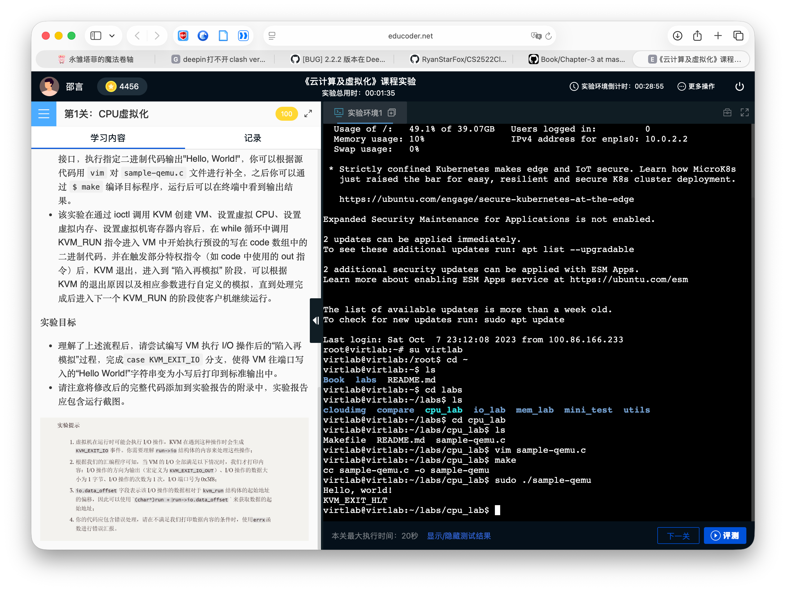

# 实验报告

## 基础问题部分

### 问题1: 请根据你的理解解释可虚拟化架构与不可虚拟化架构的概念

首先要定义“**特权指令**”和“**敏感指令**”：

- **特权指令**：必须运行在最高特权级的指令
- **敏感指令**：操作敏感物理资源的指令

虚拟化系统其中一个本质要求是“资源控制”，这要求敏感指令执行是必须陷入Hypervisor，因此Hypervisor必须运行在最高特权级。为了保证这一点，必须保证所有的敏感指令都是特权指令，这样才能出发特权级切换，陷入Hypervisor。因此可虚拟化架构和不可虚拟化架构的定义是：

**可虚拟化架构**：所有敏感指令都是特权指令的架构

**不可虚拟化架构**：不是所有敏感指令都是特权指令的架构

### 问题2: 请基于你的理解谈谈虚拟化的“陷入再模拟”的概念

虚拟化系统其中一个本质要求是“资源控制”，这要求敏感指令执行不能由虚拟机直接控制，否则无法隔离虚拟资源和物理资源。

为了解决这个问题，引入Hypervisor。当虚拟机执行敏感指令时，自动“陷入”Hypervisor，让Hypervisor与宿主机沟通，执行虚拟机想要做的指令，再返回到虚拟机。这样一来，虚拟机也会认为指令已经正确执行，虚拟机也没有直接访问敏感物理资源。

### 问题3: 请调研并用你的理解解释 Intel VT-x 的特权级是如何划分的。这种非根模式为何有助于 Hypervisor “陷入再模拟”

大多数现代CPU把特权级分为4个ring，具体如下表：

| **Ring** | **权限** | **示例**                                              |
| -------- | -------- | ----------------------------------------------------- |
| Ring 0   | 最特权   | 内核 / 操作系统核心（可直接操作硬件、修改控制寄存器） |
| Ring 1   | 较高特权 | 很少使用，部分驱动或系统服务                          |
| Ring 2   | 较低特权 | 很少使用                                              |
| Ring 3   | 用户态   | 普通应用程序（无法执行特权指令）                      |

为了满足虚拟机系统本质要求“等价”，即使是虚拟机，也要支持Ring0，但这又与虚拟机系统本质要求的“资源控制”不能直接访问物理资源矛盾。因此引入“非根模式”，这样的话，虚拟机系统仍然可以认为自己处于Ring0，而运行敏感指令的时候，会触发陷入，由Hypervisor接管。


## 实验部分

实验代码解释

| 行数    | 代码解释                                                     |
| ------- | ------------------------------------------------------------ |
| 39-70   | 汇编代码，打印“Hello, world!”                                |
| 76-85   | 定义kvm，用于给vm分配硬件资源                                |
| 87-89   | 定义vm                                                       |
| 91-106  | 分配一块内存空间，并且把它给虚拟机的内存                     |
| 108-110 | 创建一个vCPU                                                 |
| 112-121 | 把vCPU的kvm_run结构，与Hypervisor双向共享。kvm_run相当于是vCPU的实时状态板 |
| 123-131 | 初始化Code Segment                                           |
| 133-143 | 初始化Register                                               |
| 145-175 | 让vCPU运行汇编代码，定义了各类事件                           |

## 附录

### 代码

```C
/* Sample code for /dev/kvm API
 *
 * Copyright (c) 2015 Intel Corporation
 * Author: Josh Triplett <josh@joshtriplett.org>
 *
 * Permission is hereby granted, free of charge, to any person obtaining a copy
 * of this software and associated documentation files (the "Software"), to
 * deal in the Software without restriction, including without limitation the
 * rights to use, copy, modify, merge, publish, distribute, sublicense, and/or
 * sell copies of the Software, and to permit persons to whom the Software is
 * furnished to do so, subject to the following conditions:
 *
 * The above copyright notice and this permission notice shall be included in
 * all copies or substantial portions of the Software.
 *
 * THE SOFTWARE IS PROVIDED "AS IS", WITHOUT WARRANTY OF ANY KIND, EXPRESS OR
 * IMPLIED, INCLUDING BUT NOT LIMITED TO THE WARRANTIES OF MERCHANTABILITY,
 * FITNESS FOR A PARTICULAR PURPOSE AND NONINFRINGEMENT. IN NO EVENT SHALL THE
 * AUTHORS OR COPYRIGHT HOLDERS BE LIABLE FOR ANY CLAIM, DAMAGES OR OTHER
 * LIABILITY, WHETHER IN AN ACTION OF CONTRACT, TORT OR OTHERWISE, ARISING
 * FROM, OUT OF OR IN CONNECTION WITH THE SOFTWARE OR THE USE OR OTHER DEALINGS
 * IN THE SOFTWARE.
 */
#include <err.h>
#include <fcntl.h>
#include <linux/kvm.h>
#include <stdint.h>
#include <stdio.h>
#include <stdlib.h>
#include <string.h>
#include <sys/ioctl.h>
#include <sys/mman.h>
#include <sys/stat.h>
#include <sys/types.h>

int main(void)
{
    int kvm, vmfd, vcpufd, ret;
    const uint8_t code[] = {
        0xba, 0xf8, 0x03, /* mov $0x3f8, %dx */
        0xb0, 'H',       /* mov $'H', %al */
        0xee,             /* out %al, (%dx) */
        0xb0, 'e',       /* mov $'e', %al */
        0xee,             /* out %al, (%dx) */
        0xb0, 'l',       /* mov $'l', %al */
        0xee,             /* out %al, (%dx) */
        0xb0, 'l',       /* mov $'l', %al */
        0xee,             /* out %al, (%dx) */
        0xb0, 'o',       /* mov $'o', %al */
        0xee,             /* out %al, (%dx) */
        0xb0, ',',       /* mov $',', %al */
        0xee,             /* out %al, (%dx) */
        0xb0, ' ',       /* mov $' ', %al */
        0xee,             /* out %al, (%dx) */
        0xb0, 'w',       /* mov $'w', %al */
        0xee,             /* out %al, (%dx) */
        0xb0, 'o',       /* mov $'o', %al */
        0xee,             /* out %al, (%dx) */
        0xb0, 'r',       /* mov $'r', %al */
        0xee,             /* out %al, (%dx) */
        0xb0, 'l',       /* mov $'l', %al */
        0xee,             /* out %al, (%dx) */
        0xb0, 'd',       /* mov $'d', %al */
        0xee,             /* out %al, (%dx) */
        0xb0, '!',       /* mov $'!', %al */
        0xee,             /* out %al, (%dx) */
        0xb0, '\n',       /* mov $'\n', %al */
        0xee,             /* out %al, (%dx) */
        0xf4,             /* hlt */
    };
    uint8_t *mem;
    struct kvm_sregs sregs;
    size_t mmap_size;
    struct kvm_run *run;

    kvm = open("/dev/kvm", O_RDWR | O_CLOEXEC);
    if (kvm == -1)
        err(1, "/dev/kvm");

    /* Make sure we have the stable version of the API */
    ret = ioctl(kvm, KVM_GET_API_VERSION, NULL);
    if (ret == -1)
        err(1, "KVM_GET_API_VERSION");
    if (ret != 12)
        errx(1, "KVM_GET_API_VERSION %d, expected 12", ret);

    vmfd = ioctl(kvm, KVM_CREATE_VM, (unsigned long)0);
    if (vmfd == -1)
        err(1, "KVM_CREATE_VM");

    /* Allocate one aligned page of guest memory to hold the code. */
    mem = mmap(NULL, 0x1000, PROT_READ | PROT_WRITE, MAP_SHARED | MAP_ANONYMOUS, -1, 0);
    if (!mem)
        err(1, "allocating guest memory");
    memcpy(mem, code, sizeof(code));

    /* Map it to the second page frame (to avoid the real-mode IDT at 0). */
    struct kvm_userspace_memory_region region = {
        .slot = 0,
        .guest_phys_addr = 0x1000,
        .memory_size = 0x1000,
        .userspace_addr = (uint64_t)mem,
    };
    ret = ioctl(vmfd, KVM_SET_USER_MEMORY_REGION, &region);
    if (ret == -1)
        err(1, "KVM_SET_USER_MEMORY_REGION");

    vcpufd = ioctl(vmfd, KVM_CREATE_VCPU, (unsigned long)0);
    if (vcpufd == -1)
        err(1, "KVM_CREATE_VCPU");

    /* Map the shared kvm_run structure and following data. */
    ret = ioctl(kvm, KVM_GET_VCPU_MMAP_SIZE, NULL);
    if (ret == -1)
        err(1, "KVM_GET_VCPU_MMAP_SIZE");
    mmap_size = ret;
    if (mmap_size < sizeof(*run))
        errx(1, "KVM_GET_VCPU_MMAP_SIZE unexpectedly small");
    run = mmap(NULL, mmap_size, PROT_READ | PROT_WRITE, MAP_SHARED, vcpufd, 0);
    if (!run)
        err(1, "mmap vcpu");

    /* Initialize CS to point at 0, via a read-modify-write of sregs. */
    ret = ioctl(vcpufd, KVM_GET_SREGS, &sregs);
    if (ret == -1)
        err(1, "KVM_GET_SREGS");
    sregs.cs.base = 0;
    sregs.cs.selector = 0;
    ret = ioctl(vcpufd, KVM_SET_SREGS, &sregs);
    if (ret == -1)
        err(1, "KVM_SET_SREGS");

    /* Initialize registers: instruction pointer for our code, addends, and
     * initial flags required by x86 architecture. */
    struct kvm_regs regs = {
        .rip = 0x1000,
        .rax = 2,
        .rbx = 2,
        .rflags = 0x2,
    };
    ret = ioctl(vcpufd, KVM_SET_REGS, &regs);
    if (ret == -1)
        err(1, "KVM_SET_REGS");

    /* Repeatedly run code and handle VM exits. */
    while (1) {
        ret = ioctl(vcpufd, KVM_RUN, NULL);
        if (ret == -1)
            err(1, "KVM_RUN");
        switch (run->exit_reason) {
        case KVM_EXIT_HLT:
            puts("KVM_EXIT_HLT");
            return 0;
        case KVM_EXIT_IO:
        // --------------------------------------
        //---------- START YOUR CODE -------------
        if (run->io.direction == KVM_EXIT_IO_OUT && 
            run->io.size == 1 && 
            run->io.port == 0x3f8) {
            // 处理串口输出
            putchar(*((char*)run + run->io.data_offset));
            fflush(stdout);
        }
        break;
        // --------- END OF YOUR CODE ------------
        //  ------------------------------------- 
        case KVM_EXIT_FAIL_ENTRY:
            errx(1, "KVM_EXIT_FAIL_ENTRY: hardware_entry_failure_reason = 0x%llx",
                 (unsigned long long)run->fail_entry.hardware_entry_failure_reason);
        case KVM_EXIT_INTERNAL_ERROR:
            errx(1, "KVM_EXIT_INTERNAL_ERROR: suberror = 0x%x", run->internal.suberror);
        default:
            errx(1, "exit_reason = 0x%x", run->exit_reason);
        }
    }
}
```

### 运行截图

