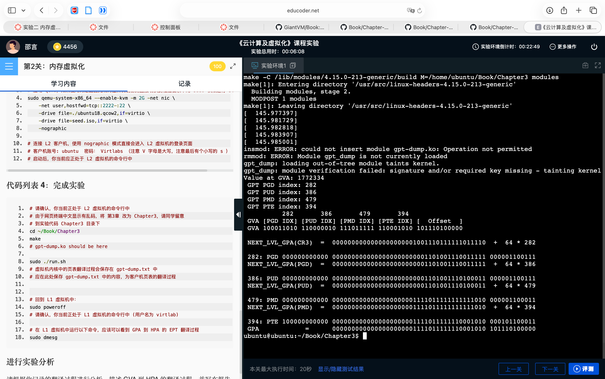
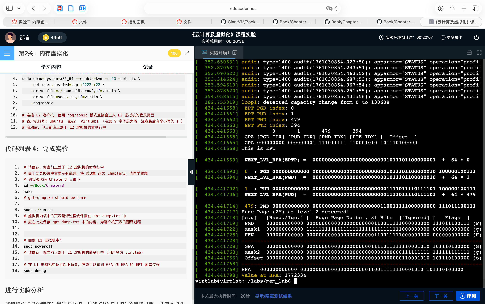

# 实验二: 内存 虚拟化

<center>[523031910224] [邵言]</center>

## 1 调研部分

### 问题1 主机的虚拟内存是如何通过页表实现的？

虚拟内存通过页表实现虚拟地址到物理地址的映射。

每个进程都有自己的页表，页表中的每个页表项（PTE）记录了一个虚拟页与物理页框之间的对应关系。

当CPU访问虚拟地址时，**内存管理单元（MMU）** 会根据当前页表，将虚拟地址的页号查找对应的物理页号，并与页内偏移量组合，得到实际的物理地址，从而访问物理内存。

若页表项无效（例如该页未在内存中），则会触发**缺页异常**，由操作系统将所需页调入内存并更新页表。

### 问题2 请画出 EPT 地址翻译过程的示意图


GuestOS通过查Guest页表把GVA转化为GPA，Hypervisor通过查EPT页表把GPA转化为HPA

### 问题3 请根据你的理解解释 QEMU是如何通过 KVM 接口建立 EPT 的

QEMU 在用户态分配一块内存，作为 Guest 看到的“虚拟物理内存”（相当于虚拟的内存条）。

KVM 在内核中根据这些内存区域的信息，建立 **GPA→HPA** 的映射关系，并写入 **EPT（Extended Page Table）**，

从而让硬件能直接把 Guest 的物理地址翻译为宿主机的真实物理地址。

## 2 实验目的

理解虚拟机是如何分配、处理内存。理解GVA，GPA，HVA，HPA的定义和转换关系。

## 3 实验步骤

1. 修改Cloud Image Config
2. 启动L2虚拟机
3. L2虚拟机上运行代码，记录输出的内存日志信息
4. 关闭L2虚拟机
5. L1虚拟机上运行代码，记录输出的内存日志信息
6. 记录、比较、分析L2和L1虚拟机上的内存日志信息

## 4 实验分析

### L2虚拟机的信息

四级页表结构：CR3→PGD→PUD→PMD→PTE→Offset，把GVA转为GPA

- CR3 = 62F9C
- PGD = 11C
- PUD = A1
- PMD = 1B3
- PTE = 53
- Offset = BE8

GPA的计算流程：

- 根据CR3存储的PGD基址和PGD_IDX，可以算出PGD条目的地址 PGD = \$(CR3) + 64 bit \* PGD_IDX
- 该PGD条目中存储的PUD基址和PUD_IDX，可以算出PUD条目的地址 PUD = \$(PGD) + 64 bit \* PUD_IDX
- 该PUD条目中存储的PMD基址和PMD_IDX，可以算出PMD条目的地址 PMD = \$(PUD) + 64 bit  * PMD_IDX
- 该PMD条目中存储的PTE基址和PTE_IDX，可以算出PFN的地址 PFN = $(PMD) + 64 bit * PTE_IDX
- GPA = PFN << 12 + Offset

其存储的内容是1772334

### L1虚拟机的信息

四级页表结构：EPTP→PGD→PUD→PMD→PTE→Offset，把GPA转为HPA

- EPTP = F782
- PGD = 0
- PUD = 0
- PMD = 1B3
- PTE = 53
- Offset = BE8

HPA的计算流程：

- 根据EPTP存储的PGD基址和PGD_IDX，可以算出EPT PGD条目的地址 PGD = \$(EPTP) + 64 bit \* PGD_IDX
- 该EPT PGD条目中存储的PUD基址和PUD_IDX，可以算出EPT PUD条目的地址 PUD = \$(PGD) + 64 bit \* PUD_IDX
- 该EPT PUD条目中存储的PMD基址和PMD_IDX，可以算出EPT PMD条目的地址 PMD = \$(PUD) + 64 bit  * PMD_IDX
- 因为是2MB大页，所以PTE和Offset共同作为实际的Offset
- HPA = PFN << 21 + Offset

其存储的内容是1772334

### L1虚拟机和L2虚拟机信息的对应

1. 对应的GPA和HPA存储内容是一样的
2. PMD，PTE，offset在两个过程中相同，是巧合，并非必然

## 5 遇到的问题及解决方案

一开始无法打开L2虚拟机，后来发现是开机脚本权限的问题。运行`sudo chmod 777 start.sh`即可。

## 附录

### L2 虚拟机的信息

```shell
gpt_dump: loading out-of-tree module taints kernel.
gpt_dump: module verification failed: signature and/or required key missing - ta
inting kernel
Value at GVA: 1772334
 GPT PGD index: 284
 GPT PUD index: 161
 GPT PMD index: 435
 GPT PTE index: 83
          284       161       435       83
 GVA [PGD IDX] [PUD IDX] [PMD IDX] [PTE IDX] [  Offset  ]
 GVA 100011100 010100001 110110011 001010011 101111101000

 NEXT_LVL_GPA(CR3)  =  0000000000000000000001100010111110011100  +  64 * 284

 284: PGD 000000000000 0000000000000000000001001000000110011111 000001100111
 NEXT_LVL_GPA(PGD)  =  0000000000000000000001001000000110011111  +  64 * 161

 161: PUD 000000000000 0000000000000000000001001000000110100000 000001100111
 NEXT_LVL_GPA(PUD)  =  0000000000000000000001001000000110100000  +  64 * 435

 435: PMD 000000000000 0000000000000000000000110110011010100010 000001100011
 NEXT_LVL_GPA(PMD)  =  0000000000000000000000110110011010100010  +  64 * 83
```

### L1虚拟机的信息

```shell
[  384.573240]  EPT PGD index: 0
[  384.573243]  EPT PUD index: 0
[  384.573244]  EPT PMD index: 435
[  384.573245]  EPT PTE index: 83
[  384.573245]           0       0       435       83
[  384.573246]  GPA [PGD IDX] [PUD IDX] [PMD IDX] [PTE IDX] [  Offset  ]
[  384.573247]  GPA 000000000 000000000 110110011 001010011 101111101000
[  384.573250] This is EPT

[  384.573251]  NEXT_LVL_HPA(EPTP) =  0000000000000000000000001111011110000010  

[  384.573272]  0  : PGD 000000000000 0000000000000000000000001111011110000001 1
[  384.573275]  NEXT_LVL_HPA(PGD)  =  0000000000000000000000001111011110000001  

[  384.573284]  0  : PUD 000000000000 0000000000000000000000001010111001010110 1
[  384.573288]  NEXT_LVL_HPA(PUD)  =  0000000000000000000000001010111001010110 5

[  384.573296]  435: PMD 000000000000 0000000000000000000000010000100000000000 1
[  384.573299] Huge Page (2M) at level 2 detected!
[  384.573300] [e.g]   [Rsvd./Ign.] [  Huge Page Number, 31 Bits  ][Ignored] [ ]
[  384.573300]  PMD    000000000000 0000000000000000000000010000100000000000 11)
[  384.573303]  Mask1  000000000000 1111111111111111111111111111111000000000 00)
[  384.573306]  HFN    000000000000 0000000000000000000000010000100000000000 00)
[  384.573309] -----------------------------------------------------------------
[  384.573310]  GPA    000000000000 0000000000000000000000110110011001010011 10)
[  384.573338]  Mask2  000000000000 0000000000000000000000000000000111111111 11)
[  384.573341]  Offset 000000000000 0000000000000000000000000000000001010011 10)
[  384.573343] -----------------------------------------------------------------
[  384.573344] HPA   000000000000 0000000000000000000000010000100001010011 10110
[  384.573372] Value at HPA: 1772334
```

### 相关截图



