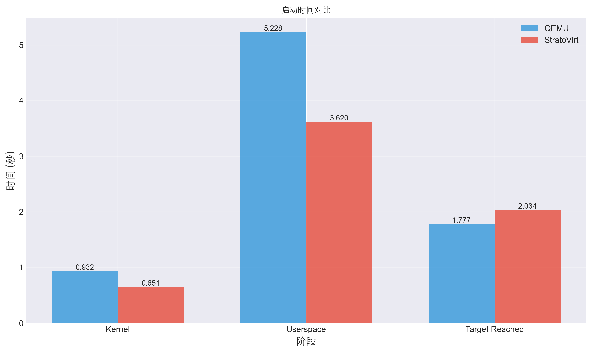
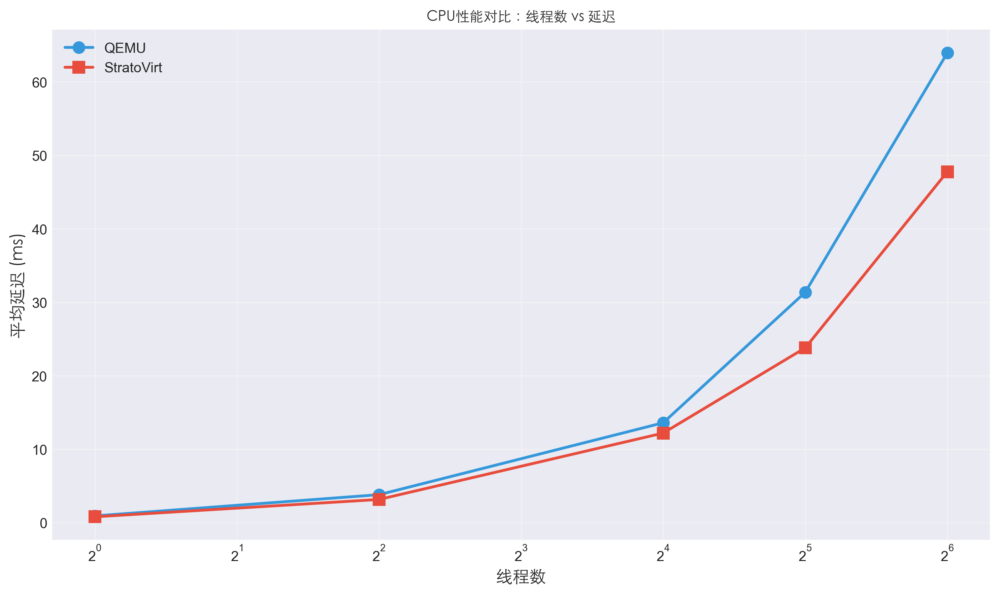
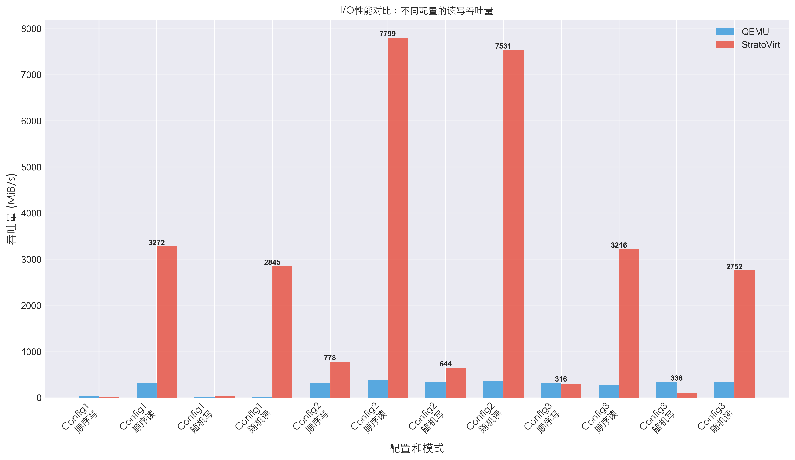

# 实验一: CPU 虚拟化

<center>[523031910224] [邵言]</center>

## 1 调研部分

### 1 Linux 启动的协议以及 E820 表是如何设计的？（参考教材 6.4.5 节）

Linux 启动协议是 bootloader 与内核之间的约定：bootloader 按固定方式加载内核，构造 *boot_params*，再跳到内核入口。协议统一了加载地址、参数结构和硬件信息传递方式，使内核无需关心具体 bootloader 实现。

E820 表是 BIOS 提供的系统物理内存布局，通过 INT 0x15, E820 获取。它以多个区间描述可用内存和保留区域。bootloader 将该表填入 boot_params 传给内核。内核据此建立物理内存管理，避免错误使用设备区或保留区。E820 的核心作用是提供标准化的机器内存拓扑。

### 2 请简述 Epoll 实现原理？（参考教材 6.4.7 节）

Epoll 基于“事件驱动 + 就绪通知”模型。内核为每个 epoll 实例维护一棵红黑树，用于保存用户加入的所有关注的文件描述符；同时维护一个就绪链表（ready list）。当某个 fd 的状态发生变化（如可读/可写），驱动在其回调中将该 fd 挂入 epoll 的就绪链表。epoll_wait 只需检查 ready list 并返回已就绪事件，而不用像 select/poll 那样重复扫描全部 fd。

这种设计让 epoll 在 fd 数量很大时仍保持 O(1) 级别的事件获取效率，适用于高并发网络服务器。

### 3 请执行以下脚本并简述 StratoVirt 的技术重点

1. 基于 KVM 的轻量虚拟机框架：通过 /dev/kvm 创建 VM、vCPU，并使用 kvm_run 完成 VM-Entry/Exit 及“陷入-模拟”执行。
2. 内存管理：使用 mmap 分配连续虚拟内存，并通过 set_user_memory_region 构建多段 Guest Memory；同时维护地址区间以支持 MMIO 设备访问。
3. 设备与 I/O 虚拟化：通过 PIO/MMIO 捕获指令，根据 guest 地址映射到 host 地址后进行读写；串口设备通过寄存器模拟完成输出与输入。
4. CPU 状态管理：保存通用寄存器与特殊寄存器，实现可扩展的多 vCPU 支持。
5. Linux 启动协议支持：构造 Zero Page、Boot Params、E820 内存表，正确加载 Linux 内核并完成启动。

## 2 实验目的

1. 对比StratoVirt和QEMU，对比其启动时间、内存占用、CPU性能、内存性能、I/O速度
2. 理解StratoVirt的轻量化设计
3. 感受轻量级虚拟化在实际应用中的性能优化、资源占用带来的使用体验提升

## 3 实验步骤

1. 根据所给代码，对比两种虚拟机上linux的启动时间
2. 根据所给代码，对比两种虚拟机再宿主机上的内存占用
3. 在虚拟机上安装sysbench
4. 比较两种虚拟机的CPU、内存、I/O性能差异

## 4 实验分析

### 启动时间

- StratoVirt 在内核启动和用户空间启动上明显快于 QEMU。
- 平均内核启动时间约为 0.65 s，比 QEMU 的 0.92 s 快约 30%。
- 用户空间启动时间 StratoVirt 约 3.62 s，QEMU 约 5.26 s，整体启动速度更快。
- 原因：StratoVirt 精简了 QEMU 的不常用功能和设备模型，采用 Rust 编写，轻量化设计提高了启动效率。



### 内存占用对比

- StratoVirt 的总内存占用约 1.13 GB，QEMU 约 1.8 GB。
- RSS 和 Dirty 内存均明显低于 QEMU，说明 StratoVirt 的进程运行时对系统资源占用更少。
- 原因：精简设备模型、减少后台线程和缓存管理开销。


### CPU 性能对比

- 单线程性能：StratoVirt 事件处理速度低于 QEMU（约 1250 vs 5000 events/s），延迟略高。
- 多线程扩展能力：随着线程数增加，StratoVirt 吞吐量提升有限，而 QEMU 提升明显，尤其是 16、32、64 线程情况下差距明显。
- 原因：StratoVirt 的多线程并行优化不如 QEMU 完善，适合轻量虚拟化和低并发场景。



### 内存性能对比

- 顺序访问和随机访问下，StratoVirt 的内存带宽略高于 QEMU，延迟差异不大。
- 随着 block size 增大，带宽降低，但 StratoVirt 的波动小于 QEMU。
- 原因：StratoVirt 内存访问和缓存管理更简单，减少了额外开销。


### I/O 性能对比

- 单线程 4k 延迟测试：StratoVirt 延迟略高于 QEMU，但吞吐量在顺序读写时更高。
- 多线程 32 线程 IOPS 和吞吐量测试：StratoVirt 在大块顺序读写上表现良好，但在随机写读时性能不如 QEMU。
- 分析：StratoVirt 轻量化设计优化了顺序 I/O，但多线程随机 I/O 扩展能力不足。



### 总结

- 轻量化优势明显：启动快、内存占用低、顺序内存/磁盘访问效率高。
- 性能限制：单线程 CPU 性能低，多线程扩展能力弱，随机 I/O 性能不如 QEMU。
- 适用场景：适合轻量虚拟化、快速部署和测试环境；不适合高并发、高负载的生产环境。


## （可选）5 遇到的问题及解决方案

### 检查StratoVirt开机时间的时候报错

```shell
systemd-analyze time
Bootup is not yet finished (org.freedesktop.systemd1.Manager.FinishTimestampMonotonic=0).
Please try again later.
Hint: Use 'systemctl list-jobs' to see active jobs
```

原因是

```shell
ystemctl list-jobs
JOB UNIT                                 TYPE  STATE  
61  systemd-networkd-wait-online.service start running
60  network-online.target                start waiting

2 jobs listed.
```

网络没上线，禁用等待网络上线即可

```shell
systemctl disable systemd-networkd-wait-online.service
systemctl stop systemd-networkd-wait-online.service
```

### 读写文件损坏

报错

```shell
[root@localhost sysbench_src]# sysbench fileio --threads=1 --file-block-size=4k
      --file-test-mode=seqrd --time=30 run
      sysbench 1.0.20 (using bundled LuaJIT 2.1.0-beta2)

      Running the test with following options:
      Number of threads: 1
      Initializing random number generator from current time

      Extra file open flags: (none)
      128 files, 16MiB each
      2GiB total file size
      Block size 4KiB
      Periodic FSYNC enabled, calling fsync() each 100 requests.
      Calling fsync() at the end of test, Enabled.
      Using synchronous I/O mode
      Doing sequential read test
      FATAL: Size of file 'test_file.46' is 7.75MiB, but at least 16MiB is expected.
      WARNING: Did you run 'prepare' with different --file-total-size or --file-num values?
```

原因是文件因为意外损坏，重新生成测试文件即可

```shell
sysbench fileio cleanup
sysbench fileio --file-total-size=2G prepare
```

### 磁盘空间不够，无法测试

报错

```shell
[root@StratoVirt sysbench_src]# sysbench fileio --file-block-size=4k --threads=1 --time=30 --file-test-mode=seqwr run
sysbench 1.0.20 (using bundled LuaJIT 2.1.0-beta2)

Running the test with following options:
Number of threads: 1
Initializing random number generator from current time

Extra file open flags: (none)
128 files, 16MiB each
2GiB total file size
Block size 4KiB
Periodic FSYNC enabled, calling fsync() each 100 requests.
Calling fsync() at the end of test, Enabled.
Using synchronous I/O mode
Doing sequential write (creation) test
Initializing worker threads...

Threads started!

FATAL: Failed to write file! file: 29 pos: 9732096 errno = 28 (No space left on device)
```

在保持每个文件大小不变的情况下，减少文件的数量

```shell
sysbench fileio cleanup
sysbench fileio --file-total-size=256M --file-num=16 prepare
```

同样的，在运行代码测试性能的时候，也需要加上`--file-num=16`


## 附录

CPU: intel

### time

#### qemu

| time | kernel | initrd | userspace | multi-user.target reached |
| :--: | :----: | :----: | :-------: | :-----------------------: |
|  1   | 0.919  |  1.40  |   5.242   |           1.931           |
|  2   | 0.926  | 1.316  |   5.273   |           1.722           |
|  3   | 0.895  | 1.302  |   5.275   |           1.728           |
|  4   | 0.893  | 1.276  |   5.282   |           1.729           |
|  5   | 0.895  | 1.294  |   5.201   |           1.734           |
|  6   | 0.887  | 1.281  |   5.290   |           1.766           |
|  7   | 0.968  | 1.375  |   5.273   |           1.789           |
|  8   | 0.926  | 1.363  |   5.253   |           1.776           |
|  9   | 0.996  | 1.401  |   5.212   |           1.800           |
|  10  | 1.019  | 1.430  |   4.976   |           1.799           |

#### stratovirt

| time | kernel | userspace | graphical.target reached |
| :--: | :----: | :-------: | :----------------------: |
|  1   | 0.647  |   3.636   |          1.793           |
|  2   | 0.637  |   3.611   |          4.249           |
|  3   | 0.650  |   3.640   |          1.809           |
|  4   | 0.640  |   3.594   |          1.772           |
|  5   | 0.649  |   3.602   |          1.767           |
|  6   | 0.677  |   3.605   |          1.773           |
|  7   | 0.658  |   3.624   |          1.815           |
|  8   | 0.654  |   3.635   |          1.781           |
|  9   | 0.653  |   3.662   |          1.804           |
|  10  | 0.641  |   3.593   |          1.776           |

### memory use

#### qemu

| time | Kbytes  |  RSS   | Dirty Mode |
| :--: | :-----: | :----: | :--------: |
|  1   | 1824384 | 495252 |   473928   |
|  2   | 1803908 | 624560 |   603108   |
|  3   | 1803908 | 632876 |   611424   |
|  4   | 1803908 | 632908 |   611456   |
|  5   | 1803908 | 632956 |   611504   |
|  6   | 1803908 | 686228 |   664776   |
|  7   | 1803908 | 686260 |   664808   |
|  8   | 1803908 | 690432 |   668980   |
|  9   | 1803908 | 805068 |   783688   |
|  10  | 1803908 | 811116 |   789420   |

#### stratovirt

| time | Kbytes  |  RSS   | Dirty Mode |
| :--: | :-----: | :----: | :--------: |
|  1   | 1128048 | 127672 |   121824   |
|  2   | 1128048 | 127820 |   121848   |
|  3   | 1128048 | 127580 |   121724   |
|  4   | 1128048 | 127864 |   121892   |
|  5   | 1128048 | 127648 |   121676   |
|  6   | 1128048 | 127904 |   121968   |
|  7   | 1128048 | 127604 |   121768   |
|  8   | 1128048 | 126748 |   120892   |
|  9   | 1128048 | 127388 |   121528   |
|  10  | 1128048 | 126480 |   120672   |

### 性能

#### qemu

##### cpu

cpu,--cpu-max-prime=10000

| time | thread | events per second | latency avg (ms) |
| :--: | :----: | :---------------: | :--------------: |
|  1   |   1    |       5061        |       0.99       |
|  2   |   1    |       5884        |       0.85       |
|  3   |   4    |       5313        |       3.75       |
|  4   |   4    |       5155        |       3.87       |
|  5   |   16   |       5894        |      13.49       |
|  6   |   16   |       5813        |      13.70       |
|  7   |   32   |       5052        |      31.43       |
|  8   |   32   |       5079        |      31.29       |
|  9   |   64   |       4827        |      65.81       |
|  10  |   64   |       5119        |      62.08       |

##### memory

Memory threads = 4

| time | block size | access mode | events /sec | latency |
| :--: | :--------: | :---------: | :---------: | :-----: |
|  1   |     1k     |     Seq     |   1832904   |  0.00   |
|  2   |     1k     |     Seq     |   1826665   |  0.00   |
|  3   |     1k     |     rnd     |   1078962   |  0.00   |
|  4   |     1k     |     rnd     |   1090551   |  0.00   |
|  5   |     2k     |     Seq     |   1657231   |  0.00   |
|  6   |     2k     |     Seq     |   1654971   |  0.00   |
|  7   |     2k     |     rnd     |   703565    |  0.00   |
|  8   |     2k     |     rnd     |   757692    |  0.00   |
|  9   |     4k     |     Seq     |   1456968   |  0.00   |
|  10  |     4k     |     seq     |   1429842   |  0.00   |
|  11  |     4k     |     rnd     |   465320    |  0.01   |
|  12  |     4k     |     Rnd     |   453210    |  0.01   |
|  13  |     8k     |     seq     |   1152278   |  0.00   |
|  14  |     8k     |     seq     |   1139605   |  0.00   |
|  15  |     8k     |     Rnd     |   259044    |  0.01   |
|  16  |     8k     |     rnd     |   268518    |  0.01   |

##### I/O

1. Config1: 线程数为1，bs设置为4k，测试模拟单个队列读写的延迟
2. config2: 线程数为32，bs设置为128k，测试吞吐量，跑满整个磁盘带宽
3. config3: 线程数为32，bs设置为4k，测试 IOPS

| time | config | mode  | reads/s  | writes/s | fsyncs/s | read,MiB/s | written MiB/s | latency |
| :--: | :----: | :---: | :------: | :------: | :------: | :--------: | :-----------: | :-----: |
|  1   |   1    | seqwr |    0     | 6437.53  | 8241.64  |     0      |     25.15     |  0.07   |
|  2   |   1    | seqwr |    0     | 6343.25  | 8120.93  |     0      |     24.78     |  0.07   |
|  3   |   1    | Seqrd | 77587.71 |    0     |    0     |   303.08   |       0       |  0.01   |
|  4   |   1    | seqrd | 81245.49 |    0     |    0     |   317.37   |       0       |  0.01   |
|  5   |   1    | rndwr |    0     | 2073.99  | 2655.40  |     0      |     8.10      |  0.21   |
|  6   |   1    | rndwr |    0     | 2166.03  | 2776.71  |     0      |     8.46      |  0.20   |
|  7   |   1    | rndrd | 3273.83  |    0     |    0     |   12.79    |       0       |  0.30   |
|  8   |   1    | rndrd | 3224.48  |    0     |    0     |   12.60    |       0       |  0.31   |
|  9   |   2    | seqwr |    0     | 2444.79  | 3263.27  |     0      |    305.60     |  5.69   |
|  10  |   2    | seqwr |    0     | 2505.99  | 3342.48  |     0      |    313.25     |  5.55   |
|  11  |   2    | seqrd | 3013.24  |    0     |    0     |   376.65   |       0       |  10.60  |
|  12  |   2    | seqrd | 2886.89  |    0     |    0     |   360.86   |       0       |  11.05  |
|  13  |   2    | rndwr |    0     | 2580.65  | 3436.07  |     0      |    322.58     |  5.39   |
|  14  |   2    | rndwr |    0     | 2659.51  | 3538.21  |     0      |    332.44     |  5.22   |
|  15  |   2    | rndrd | 2949.02  |    0     |    0     |   368.63   |       0       |  10.82  |
|  16  |   2    | rndrd | 2881.73  |    0     |    0     |   360.22   |       0       |  11.08  |
|  17  |   3    | seqwr |    0     | 2610.44  | 3476.36  |     0      |    314.04     |  5.34   |
|  18  |   3    | seqwr |    0     | 2644.50  | 3520.09  |     0      |    318.14     |  5.27   |
|  19  |   3    | seqrd | 2620.66  |    0     |    0     |   315.27   |       0       |  12.19  |
|  20  |   3    | seqrd | 2004.83  |    0     |    0     |   241.18   |       0       |  15.92  |
|  21  |   3    | rndwr |    0     | 2807.27  | 3726.09  |     0      |    338.57     |  4.95   |
|  22  |   3    | rndwr |    0     | 2792.25  | 3707.73  |     0      |    336.82     |  4.97   |
|  23  |   3    | rndrd | 2793.63  |    0     |    0     |   337.01   |       0       |  11.43  |
|  24  |   3    | rndrd | 2750.92  |    0     |    0     |   331.89   |       0       |  11.61  |

#### StratoVirt

##### cpu

cpu,--cpu-max-prime=10000

| time | thread | events per second | latency avg (ms) |
| :--: | :----: | :---------------: | :--------------: |
|  1   |   1    |       1252        |       0.80       |
|  2   |   1    |       1255        |       0.80       |
|  3   |   4    |       1256        |       3.15       |
|  4   |   4    |       1250        |       3.17       |
|  5   |   16   |       1269        |      12.14       |
|  6   |   16   |       1271        |      12.25       |
|  7   |   32   |       1261        |      23.92       |
|  8   |   32   |       1269        |      23.67       |
|  9   |   64   |       1145        |      49.36       |
|  10  |   64   |       1233        |      46.17       |

##### memory

Memory threads = 4

| time | block size | access mode | events /sec | latency |
| :--: | :--------: | :---------: | :---------: | :-----: |
|  1   |     1k     |     Seq     |   2197550   |  0.00   |
|  2   |     1k     |     Seq     |   2086536   |  0.00   |
|  3   |     1k     |     rnd     |   1241593   |  0.00   |
|  4   |     1k     |     rnd     |   1250813   |  0.00   |
|  5   |     2k     |     Seq     |   1998896   |  0.00   |
|  6   |     2k     |     Seq     |   1920943   |  0.00   |
|  7   |     2k     |     rnd     |   807468    |  0.00   |
|  8   |     2k     |     rnd     |   810719    |  0.00   |
|  9   |     4k     |     Seq     |   1639204   |  0.00   |
|  10  |     4k     |     seq     |   1629454   |  0.00   |
|  11  |     4k     |     rnd     |   484260    |  0.01   |
|  12  |     4k     |     Rnd     |   484382    |  0.01   |
|  13  |     8k     |     seq     |   1246568   |  0.00   |
|  14  |     8k     |     seq     |   1252054   |  0.00   |
|  15  |     8k     |     Rnd     |   269157    |  0.01   |
|  16  |     8k     |     rnd     |   257956    |  0.01   |

##### I/O

1. Config1: 线程数为1，bs设置为4k，测试模拟单个队列读写的延迟
2. config2: 线程数为32，bs设置为128k，测试吞吐量，跑满整个磁盘带宽
3. config3: 线程数为32，bs设置为4k，测试 IOPS

| time | config | mode  |  reads/s  | writes/s | fsyncs/s | read,MiB/s | written MiB/s | latency |
| :--: | :----: | :---: | :-------: | :------: | :------: | :--------: | :-----------: | :-----: |
|  1   |   1    | seqwr |     0     | 4580.43  | 5868.24  |     0      |     17.89     |  0.09   |
|  2   |   1    | seqwr |     0     | 4540.43  | 5823.73  |     0      |     17.74     |  0.10   |
|  3   |   1    | Seqrd | 831961.10 |    0     |    0     |  3249.85   |       0       |  0.00   |
|  4   |   1    | seqrd | 843081.82 |    0     |    0     |  3293.29   |       0       |  0.00   |
|  5   |   1    | rndwr |     0     | 8561.15  | 1370.28  |     0      |     33.44     |  0.10   |
|  6   |   1    | rndwr |     0     | 8112.81  | 1298.95  |     0      |     31.69     |  0.11   |
|  7   |   1    | rndrd | 727341.21 |    0     |    0     |  2841.18   |       0       |  0.00   |
|  8   |   1    | rndrd | 729524.55 |    0     |    0     |  2849.71   |       0       |  0.00   |
|  9   |   2    | seqwr |     0     | 6352.27  | 1066.46  |     0      |    794.03     |  4.32   |
|  10  |   2    | seqwr |     0     | 6094.09  | 1025.24  |     0      |    761.76     | 761.76  |
|  11  |   2    | seqrd | 62212.75  |    0     |    0     |  7776.59   |       0       |  0.50   |
|  12  |   2    | seqrd | 62569.22  |    0     |    0     |  7821.15   |       0       |  0.49   |
|  13  |   2    | rndwr |     0     | 5203.07  |  882.83  |     0      |    650.38     |  5.28   |
|  14  |   2    | rndwr |     0     | 5095.10  |  864.97  |     0      |    636.89     |  5.38   |
|  15  |   2    | rndrd | 60386.74  |    0     |    0     |  7548.34   |       0       |  0.51   |
|  16  |   2    | rndrd | 60110.33  |    0     |    0     |  7513.79   |       0       |  0.51   |
|  17  |   3    | seqwr |     0     | 75374.40 | 12110.52 |     0      |    294.43     |  0.36   |
|  18  |   3    | seqwr |     0     | 76136.31 | 12232.40 |     0      |    297.41     |  0.36   |
|  19  |   3    | seqrd | 797441.09 |    0     |    0     |  3115.00   |       0       |  0.03   |
|  20  |   3    | seqrd | 848962.48 |    0     |    0     |  3316.26   |       0       |  0.03   |
|  21  |   3    | rndwr |     0     | 25502.89 | 4130.79  |     0      |     99.62     |  1.08   |
|  22  |   3    | rndwr |     0     | 25133.53 | 4071.17  |     0      |     98.18     |  1.09   |
|  23  |   3    | rndrd | 704051.89 |    0     |    0     |  2750.20   |       0       |  0.03   |
|  24  |   3    | rndrd | 704786.78 |    0     |    0     |  2753.07   |       0       |  0.03   |


