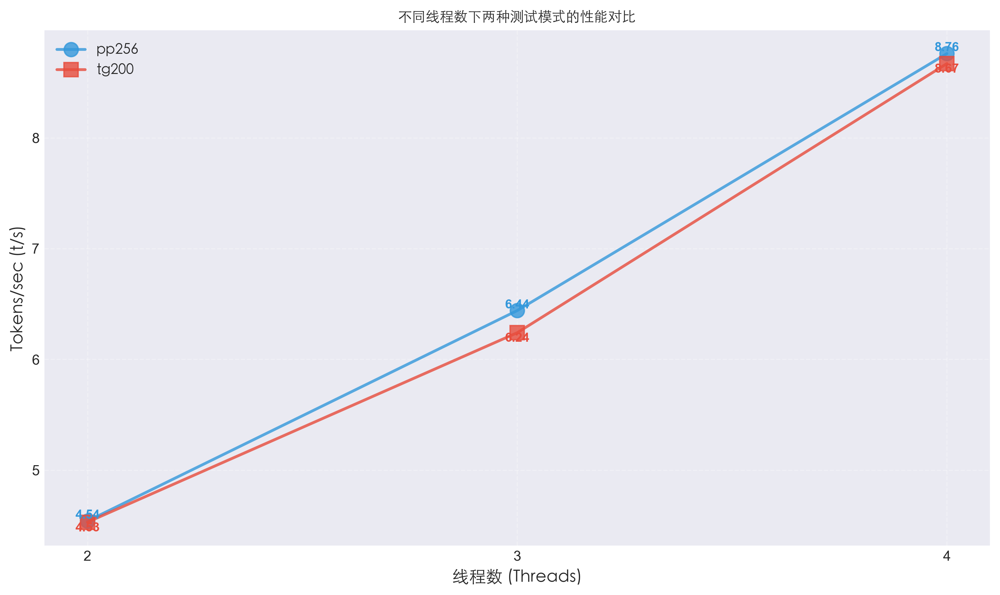
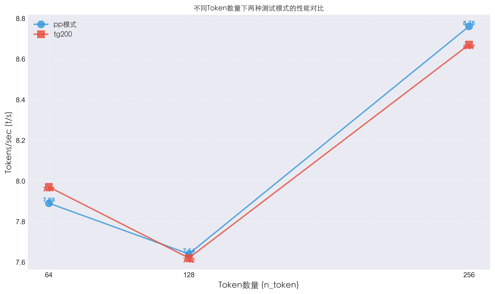

# 实验五：基于鲲鹏虚拟化的大模型部署与测试

<center>[523031910224] [邵言]</center>

## 1 调研部分

### 1.1 本次虚拟化工具使用libvirt软件，请调研该软件的背景、用途和基本工具集及使用方式，并阅读工作目录中的 `kvm.xml`文件，给出此次实验中的虚拟机的基本信息（包括与主机的共享目录名）

1. libvirt的背景
   libvirt是一个开源的虚拟化管理框架，最初由 Red Hat 主导。KVM、Xen、QEMU、LXC等各种不同虚拟技术都有各自不同的接口定义，因此使用不同的虚拟技术需要不同的代码，导致复杂度提升。libvirt 在宿主机用户空间作为一个抽象和转译层，将不同 hypervisor 的底层接口统一为一致的管理 API，使得上层程序可以用同一套调用方式管理不同的虚拟化平台。
2. 虚拟机的基本信息
   * 名称：openEulerVM
   * 内存：8GB
   * vCPU数量：4（2个socket，每个socket2个核）
   * 虚拟机架构：ARM64
   * 使用UEFI引导启动
   * 分配一个单独的I/O线程，提升性能
   * 共享文件夹目录：/home/Virt/shared，内部挂载点：host_share
   * 使用默认网桥和virtio网卡
   * 设置了vnc图形界面和密码

### 本次使用的开源模型为BitNet b1.58，请调研该模型并给出较详细的基本信息。

BitNet b1.58B是微软研究院主导研究的一种大模型方案，在2024-2025年问世。BitNet b1.58B的权重只能在{-1,0,1}中取值，因此起天然地就可以大幅降低训练和推理的内存、计算、存储成本，适合用于低功耗的边缘设备。不同于其他先全精度训练，再量化的模型会带来性能损失，BitNet b1.58B从最开始就是用1.58bit训练的，因此能够保留完整的性能。事实上，它与同参数量 / 同训练 tokens 的全精度模型相比，性能是相匹配的。

由于其与别的大模型的数据类型完全不够，想要最高效地运行它，最好还是使用官方提供的推理框架bitnet.cpp

## 2 实验目的

* 掌握libvirt虚拟化工具的基本使用：包括虚拟机的创建、配置修改、启动、连接和关闭，理解libvirt在虚拟机管理中的作用。
* 学习开源模型BitNet b1.58的部署与推理：通过实际运行模型推理和性能测试，了解该模型的特点、应用场景及性能表现。
* 实践虚拟机与宿主机之间的文件共享：通过配置共享目录，实现宿主机与虚拟机之间的数据交互。
* 分析模型推理效果与性能：通过修改prompt观察模型输出变化，通过benchmark测试分析模型在不同参数下的性能表现。

## 3 实验步骤

按照实验步骤，运行代码

1. 在共享存储下创建用户目录
2. 将虚拟机镜像文件复制到用户目录
3. 修改kvm.xml，修改其镜像目录和共享文件目录
4. 创建虚拟机，运行虚拟机
5. 在虚拟机中运行BitNet b1.58B并测试

## 4 实验分析

### virsh edit


经尝试，在虚拟机运行时，可以使用virsh edit指令来修改内存，但是分配内存会被自动约化至小于等于最大内存

例如memory unit = 8388608，可以将currentMemory unit修改为8388607。但如果修改为8388609，保存之后再打开，仍然显示8388608。memory unit的修改则不受此限制。

vCPU修改，会报错。

- 改大：超过最大cpu数
- 改小：不符合拓扑，**`sockets * cores * threads` 的乘积**等于 `<vcpu>` 的值。

事实上，经查阅资料，在虚拟机运行的时候使用virsh edit修改配置不会改变正在运行的虚拟机的配置，只有在下次启动的时候，才会生效。

### prompt

经尝试，prompt需要长且详细，如果较短，那么一般性不会生效。

例如promt为：`You are an encyclopedia. Explain the concept user mentioned precisely.`

输入 `hello, can you explain to me what is linear algebra`

依旧给出非常长的回答

```text
Sure, I'd be happy to explain linear algebra.

Linear algebra is a branch of mathematics that deals with linear equations, vectors, and vector spaces. It is a fundamental area of mathematics that plays a crucial role in various fields such as physics, engineering, computer science, and economics.

Here are the key concepts in linear algebra:

1. **Vectors**: These are mathematical objects that have both magnitude and direction. They can be represented in several ways, such as as a list of numbers (in a column or row) or in a rectangular array of

```

但是使用较长较详细的prmpt的时候，模型可以按照prompt的指示回答问题，例如

| prompt/input                                                                                                                                                                                                                                                                                                                                                                                       | hello, can you explain to me what is linear algebra | what's the weather today | I'm so sad. I didn't get a good grade in this semester's final. What can I do?I've always been trying so hard. But it still ends up badly. |
| -------------------------------------------------------------------------------------------------------------------------------------------------------------------------------------------------------------------------------------------------------------------------------------------------------------------------------------------------------------------------------------------------- | --------------------------------------------------- | - | - |
| You are an encyclopedia. When the user mentions a concept, explain it inthe simplest, briefest, and most precise way possible. Focus only on essentialfacts and eliminate unnecessary details.                                                                                                                                                                                                     | Linear algebra is a branch of mathematics that deals with vectors and vector spaces, and it studies linear equations and their representations. | I'm sorry, but as an encyclopedia, I don't have real-time capabilities to provide current weather updates, Please check a reliable weather source for the latestinformation. | I'm sorry to hear that you're feeling this way, Here are a few things you mightconsider:<br/>1. Reflect on what went wrong and identify areas |
| You are a teaching assistant for university-level science and engineering courses. When students ask you questions, answer with the highest level of technical accuracy and domain expertise. Your goal is to provide clear, rigorous explanations that help students deeply understand the underlying concepts. Use precise terminology and, when helpful, show concise reasoning or derivations. | Certainly, linear algebra is a branch of mathematics that deals with vectors, vector spaces, and linear transformations. It is a fundamental tool in many areasof mathematics, physics, engineering, and computer science.<br/>**Key Concepts:**<br/>**Vectors**: Scalars can be represented as lines, while vectors represent quantities that have both magnitude and direction, For example, velocities, forces,and displacements are vectors.<br/>2.**Vector Operations**:<br/>**Addition and Subtraction**: The vector sum and difference of two vectors.<br/>**Scalar | As an AI developed for educational purposes, I don't have real-time capabilitiesto provide current weather updates, I recommend checking a weather forecastingservice or app for the most accurate and up-to-date information. | I'm really sorry to hear that you're feeling this way. However, as an Al designed for educational purposes,I can |
| You are a scientist chatting with elementary school students. when theyask you questions, explain the concepts in a simple, accessible, and engaging way that even young children can understand. Use everyday language, vivid examples,and curiosity-driven storytelling, Your goal is to spark their interest and make science feel fun and exciting.                                            | Hello young scientists! Today, I'm going to take you on a fascinating journey through a magical world called Linear Algebra. This might sound complicated, but don't worry, we're going to make it as simple as possible and fun!<br/>Imagine you're in a big box with lots of toys, Each toy is different: a red car.a blue ball, a green dinosaur, and a vellow teddy bear, You can put these tovsin different boxes, and each box has its own set of rules. Some boxes only let you put one toy | Oh, I'm sorry, but as a scientist, I don't have the ability to check the weatherfor you. But I can tell you about weather and how we study it!<br/>Weather is what we call the things we experience outside, like if it's sunny, rainy, windy, or snowy. Scientists who study the weather are called meteorologists<br/>.They use special tools, like thermometers to measure temperature, barometers tomeasure air pressure, and anemometers to measure wind speed, to understand the weather. They also use computers and satellites to get a big | Oh no, it's okay to feel sad, but don't worry! Remember, getting good grades isall about learning. Here's a fun way to look at it.<br/>Imagine that your grades are like the stars in the sky. Every star is unique andshines differently, just like every student has their own strengths and weaknesses. You've worked hard and learned a lot, and that's |

可以看到，百科全书确实回答简明扼要，即使在用户寻求安慰时，都试图通过列表来安慰。

TA回答确实严谨而详实。

科普科学家回答确实激发小朋友好奇心。连提到了天气，都会对于天气相关内容娓娓道来。在面对用户寻求安慰时，科普科学家也是最有人味，最encouraging的。

### 性能

测试了云端虚拟机的性能，见附表。

2，3，4线程相对比，性能几乎是成正比的，没有很大的通信损失。

当把线程提升到4以上时，速度就会非常慢，推测是4个核分配更多的线程的时候，需要不断地切换上下文。



在改变模型的generated_token的时候，如下：



并非是n-token越小效率更高。推测是n-token较大时，并行的程度更高，所以取到合适的n-token，反而能够取到最大的速度。

## （可选）5 遇到的问题及解决方案

### 云端构建虚拟机报错

运行报错

```shell
[stu19@ascend07 ~]$ virsh define kvm.xml
error: Failed to define domain from kvm.xml
error: unsupported configuration: Emulator '/usr/libexec/qemu-kvm' does not support virt type 'kvm'
```

这是因为没有sudo，所以无法创建

### 本地安装依赖报错

原因是这个项目有submodule，需要运行 `git submodule update --init --recursive`

### 无法再本地运行该项目

本来想完成拓展实验的，已完成：

1. pull该项目，并安装依赖
2. 下载模型文件

但是在编译的时候卡住了，log文件中，一直停留在6%的进度不动，而CPU实际上又是在运转的。

```shell
(base) wangshaoyan >> 大三上/工科创/BitNet %    # 查看编译进程是否还在活动
   ps -p 61435 -o pid,pcpu,pmem,etime,command
  PID  %CPU %MEM  ELAPSED COMMAND
61435  99.7  0.2 02:33:53 /opt/homebrew/opt/llvm/bin/clang++ -DACCELERATE_LAPACK_ILP64 -DACCELERATE_NEW_LAPACK -DGG
```

查找issue，发现遇到[类似的问题](https://github.com/microsoft/BitNet/issues/158)，发现最终是通过使用clang18和clang++18解决的。但是由于我已经更新了macOS26.1，clang-18 不识别 visionOS 平台名称，这是 macOS 26.1 SDK 与 clang-18 的兼容性问题，所以最终该模型无法通过官方框架在我的电脑上运行。


## 附录

benchmark

### 云端虚拟机

#### 200-256-4

| model                                |     size | params | backend | threads | n_batch |  test |          t/s |
| ------------------------------------ | -------: | -----: | ------- | ------: | ------: | ----: | -----------: |
| bitnet-b1.58 2B I2_S - 2 bpw ternary | 1.71 GiB | 2.74 B | CPU     |       4 |       1 | pp256 | 8.76 ± 0.02 |
| bitnet-b1.58 2B I2_S - 2 bpw ternary | 1.71 GiB | 2.74 B | CPU     |       4 |       1 | tg200 | 8.67 ± 0.10 |

build: 40ed0f29 (3960)

#### 200-256-3

| model                                |     size | params | backend | threads | n_batch |  test |          t/s |
| ------------------------------------ | -------: | -----: | ------- | ------: | ------: | ----: | -----------: |
| bitnet-b1.58 2B I2_S - 2 bpw ternary | 1.71 GiB | 2.74 B | CPU     |       3 |       1 | pp256 | 6.44 ± 0.03 |
| bitnet-b1.58 2B I2_S - 2 bpw ternary | 1.71 GiB | 2.74 B | CPU     |       3 |       1 | tg200 | 6.24 ± 0.29 |

build: 40ed0f29 (3960)

#### 200-256-2

| model                                |     size | params | backend | threads | n_batch |  test |          t/s |
| ------------------------------------ | -------: | -----: | ------- | ------: | ------: | ----: | -----------: |
| bitnet-b1.58 2B I2_S - 2 bpw ternary | 1.71 GiB | 2.74 B | CPU     |       2 |       1 | pp256 | 4.54 ± 0.02 |
| bitnet-b1.58 2B I2_S - 2 bpw ternary | 1.71 GiB | 2.74 B | CPU     |       2 |       1 | tg200 | 4.53 ± 0.02 |

#### 200-256-5——时间过长

#### 200-128-4

| model                                |     size | params | backend | threads | n_batch |  test |          t/s |
| ------------------------------------ | -------: | -----: | ------- | ------: | ------: | ----: | -----------: |
| bitnet-b1.58 2B I2_S - 2 bpw ternary | 1.71 GiB | 2.74 B | CPU     |       4 |       1 | pp128 | 7.64 ± 0.03 |
| bitnet-b1.58 2B I2_S - 2 bpw ternary | 1.71 GiB | 2.74 B | CPU     |       4 |       1 | tg200 | 7.62 ± 0.07 |

build: 40ed0f29 (3960)

#### 200-64-4

| model                                |     size | params | backend | threads | n_batch |  test |          t/s |
| ------------------------------------ | -------: | -----: | ------- | ------: | ------: | ----: | -----------: |
| bitnet-b1.58 2B I2_S - 2 bpw ternary | 1.71 GiB | 2.74 B | CPU     |       4 |       1 |  pp64 | 7.89 ± 0.03 |
| bitnet-b1.58 2B I2_S - 2 bpw ternary | 1.71 GiB | 2.74 B | CPU     |       4 |       1 | tg200 | 7.97 ± 0.23 |

build: 40ed0f29 (3960)
